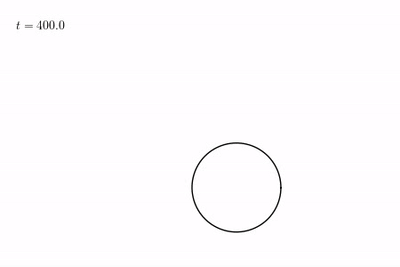

# PARADVECT

<p align="center">
    
    
</p>
<p align="center">
  Examples of particles advected by a flow around a vibrating cylinder.
</p>

PARADVECT is a Python code that computes trajectories of particles advected by a flow (PARticle ADVECTion). If a body is present in the flow, it can also calculate the rate at which particles are captured.

This module was the subject of my MSc research project at Polytechnique Montréal:
[Mouad Boudina, On the mechanics of vibrating soft corals and particle capture, Polytechnique Montréal, 2020]().

## Dependencies

PARADVECT works on Python (version 3.8.2) with NumPy (version 1.17.4), SciPy (version 1.4.1), and Matplotlib (version 3.1.2) modules.

## Usage

The main objects used in PARADVECT are:
- `Flow`: contains the flow solution (timeline, mesh, velocities and pressures at nodes, geometry of bodies, etc.)
- `Element`: a finite triangular element. Notice that this code works only for triangular elements.
- `Particle`: contains the particle characteristics (diameter, density, launch time, etc.)

### Advection
After loading a flow `flow` and creating a particle `particle`, you can compute the advection trajectory simply with `particle.compute_trajectory(flow, factor)`. The integer `factor` is a refinement factor that refines the timeline, so that the integration time step gets smaller. There is no interaction between particles. In fact, this code integrates the trajectory of a single particle in the flow.

We would like to mention that this code uses the neighbour-to-neighbour particle tracer algorithm proposed by [Löhner and Ambrosiano (1990)](doi.org/10.1016/0021-9991(90)90002-I), and implemented in `element_search.py`.

### Capture rate
The file `automatic_search_scripts.py` contains all necessary function to calculate the capture rate, which can be executed from `automatic_search.py`. The calculation method is based on dichotomy, and explained in chapter 4 in my thesis.

### Capture criterion
We adopted the solid contact as a capture criterion: a particle is captured as soon as it touches the wall of the body. The implementation of this criterion is general of bodies of any shape. I included in my thesis an appendix that explains the method I used to detect particles hitting the wall.

### Classic flows
In `msh_process.py`, you can create your own mesh with Gmsh, and assign to each node the solution of a classic flow (e.g. Couette, Poiseuille, inviscid flow around cylinder, etc.)

### Pathlines and frontlines
We also provide scripts that calculate pathlines and frontlines of the flow in `pathline.py` and `frontline.py`.

### Animations
Depending on the simulation case, the `animation`-scripts show the animation of advected particles, pathlines, or frontlines. There is the possibility to save an image sequence of the simulations, then convert it to either video or an animated GIF image. Pull requests are always welcome!

## Citing
[](https://zenodo.org/badge/latestdoi/268262918)
This code is made for sharing. If you find it helpful in your work, here is the DOI number to cite it: 10.5281/zenodo.3981610. A possible BibTeX entry might be:
```
@misc{paradvect2020,
	title = {{Paradvect} ({PARticle} {ADVECTion}): a {Python} code to simulate the trajectory of particles advected by a fluid flow},
    doi = {10.5281/zenodo.3981610},
	url = {https://github.com/mou3adb/PARADVECT},
	publisher = {Zenodo},
	author = {Boudina, M.},
	year = {2020}
}
```
Enjoy spreading particles!

## License
[MIT](https://choosealicense.com/licenses/mit/)

